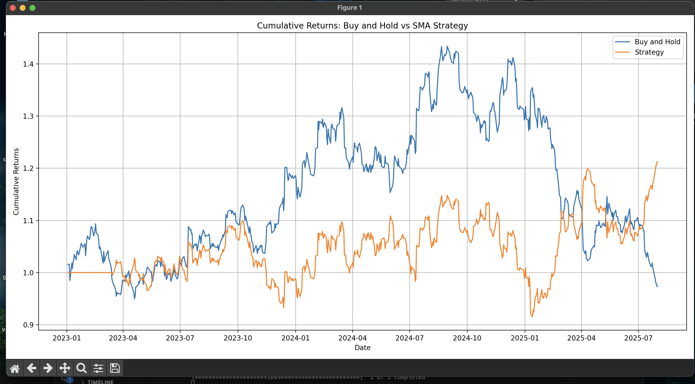

# Stock Strategy Backtester

A Python-based tool that fetches historical stock data, calculates key technical indicators, and backtests a **Golden Cross trading strategy**. The results are visualized and compared against a traditional buy-and-hold approach.

---

## Features

- Fetches historical stock price data using `yfinance`
- Calculates 20-day and 50-day simple moving averages (SMA)
- Implements the Golden Cross and Death Cross strategy
- Backtests strategy performance vs Buy-and-Hold
- Visualizes cumulative returns using `matplotlib`

---

## Strategy Logic

- **Golden Cross:** Buy when 20-day SMA crosses **above** the 50-day SMA
- **Death Cross:** Sell when 20-day SMA crosses **below** the 50-day SMA
- Strategy returns are computed based on daily price changes and plotted alongside standard buy-and-hold returns

---

##  Sample Output

> Cumulative Returns: Buy and Hold vs Strategy  
>  
> 


---

##  Tech Stack

- Python 3.x
- [yfinance](https://pypi.org/project/yfinance/) – for stock data
- pandas – for time-series data processing
- NumPy – for numerical operations
- matplotlib – for plotting results

---

##  Setup Instructions

1. **Clone the repository**
   ```bash
   git clone https://github.com/your-username/stock-strategy-backtester.git
   cd stock-strategy-backtester

2. # (Optional) Create a virtual environment
python -m venv .venv
source .venv/bin/activate  # On Windows: .venv\Scripts\activate

3. # Install dependencies
pip install -r requirements.txt

4. # Run the script
python backtester.py

## File Structure
stock-strategy-backtester/
├── backtester.py        # Main script
├── requirements.txt     # Python dependencies
├── README.md            # Project documentation
└── .gitignore           # Files to ignore in version control
